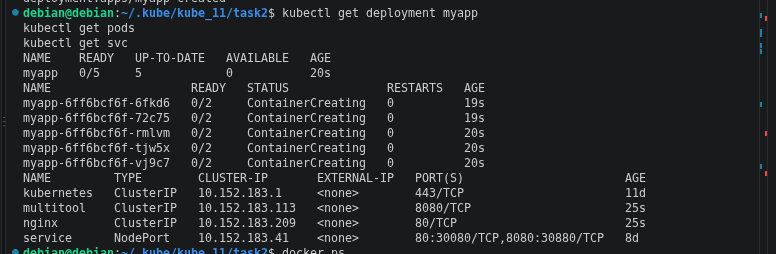
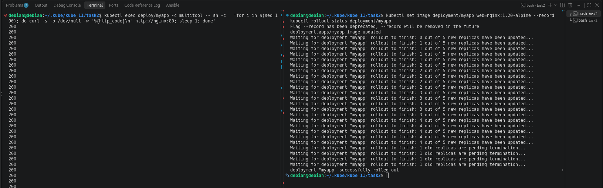
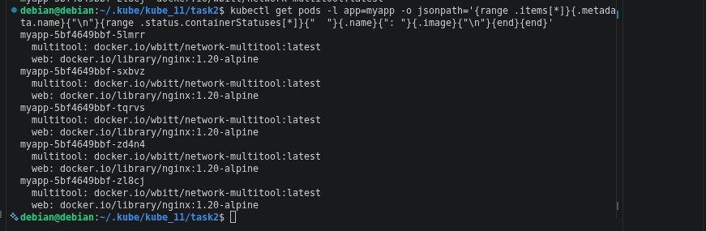
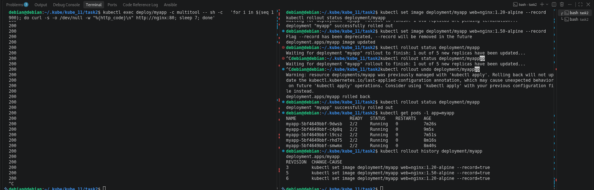
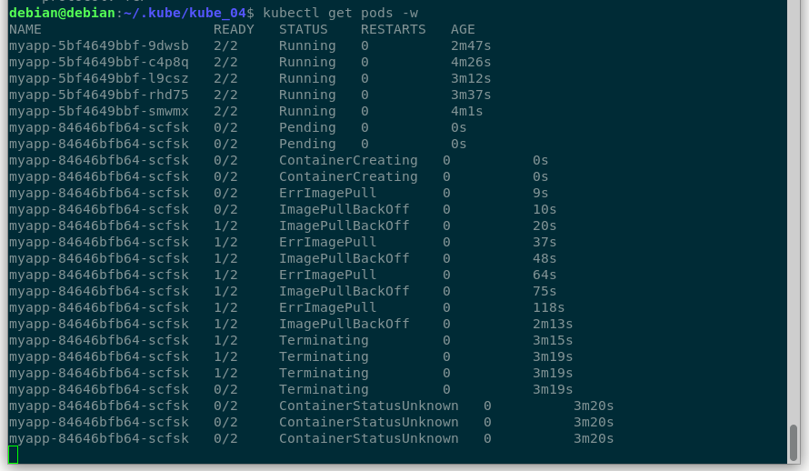
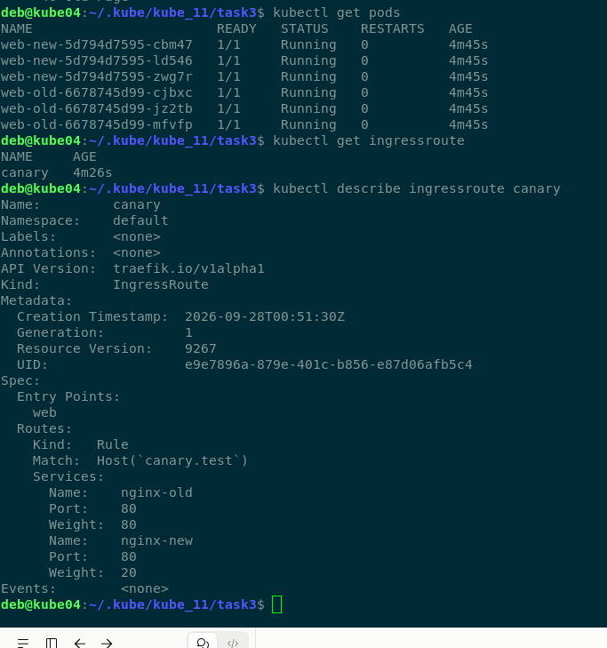
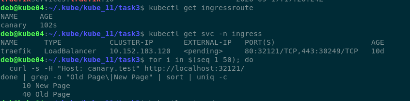

# kube_11

## Задание 1. Выбрать стратегию обновления приложения и описать ваш выбор
  
1. Имеется приложение, состоящее из нескольких реплик, которое требуется обновить.  
2. Ресурсы, выделенные для приложения, ограничены, и нет возможности их увеличить.  
3. Запас по ресурсам в менее загруженный момент времени составляет 20%.  
4. Обновление мажорное, новые версии приложения не умеют работать со старыми.  
  
> Решение:  
  
Использовать стратегию RollingUpdate  
  
Остальные стратегии не подходят по условиям задачи:  
Canary Blue-Green A/B не подходит по причине необходимости поднятия дополнительного ресурса, в котором мы ограничены.  
Recreate действует через пересоздание, что приводит к падению сервиса и в результате простой.  
  
Так же нужно будет указать "maxUnavailable: 0" и "maxSurge: 1". Обновление проводиться в момент низкой нагрузки, чтобы было место на создание одного нового пода и проведение readnesProbe.  
  
## Задание 2. Обновить приложение

### Манифесты
  
**[deploy.yaml](https://github.com/ufilin/kube_11/blob/main/task2/deploy.yaml)**  
  
**[service.yaml](https://github.com/ufilin/kube_11/blob/main/task2/service.yaml)**  
  

### Скриншоты
  
> Создание Deployment приложения с контейнерами nginx и multitool

  

  
> Обновление версии nginx до 1.20

  

  
> Результат обновления nginx до 1.20

  

  
> Результат обновления nginx до несуществующий версии 1.50 и откат до предыдущей ревизии

  

  
> Поведение подов во время обновления до несуществующей версии

  

  
## Задание 3. Создать Canary deployment*

### Манифесты
  
**[deploy-1.yaml](https://github.com/ufilin/kube_11/blob/main/task3/deploy-1.yaml)**  
  
**[deploy-2.yaml](https://github.com/ufilin/kube_11/blob/main/task3/deploy-2.yaml)**  
  
**[configMap.yaml](https://github.com/ufilin/kube_11/blob/main/task3/configmap.yaml)**  
  
**[IngressRoute.yaml](https://github.com/ufilin/kube_11/blob/main/task3/ingressRoute.yaml)**  

**[service.yaml](https://github.com/ufilin/kube_11/blob/main/task3/service.yaml)**  
  
### Скриншоты
  

  

  

  

